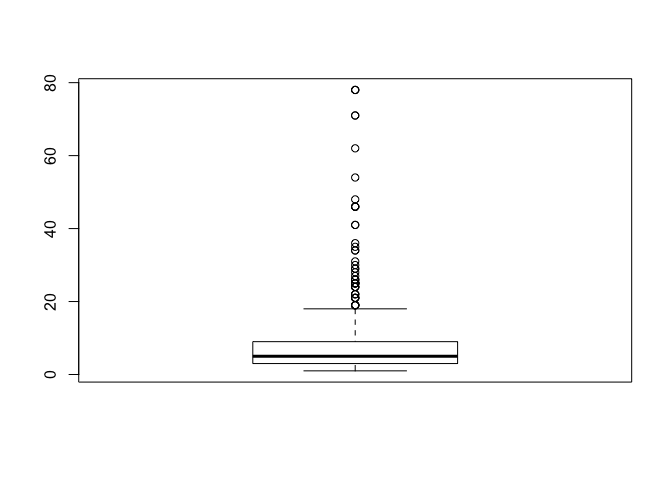

# Description of Sample Data & Preliminary Analysis


Load in the sample Data 


```r
sample_data<- read.csv("Data /sample_data.csv")
boxplot(sample_data$linkcount)
```

<!-- -->

Coding place of birth into US (0) or not US (1) . 


