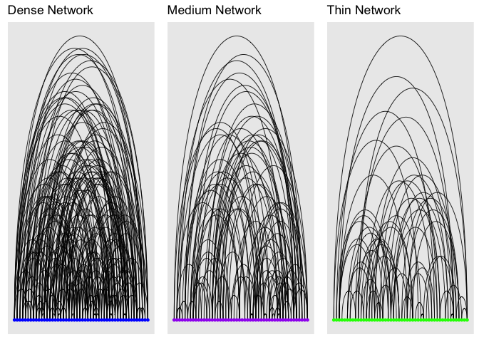
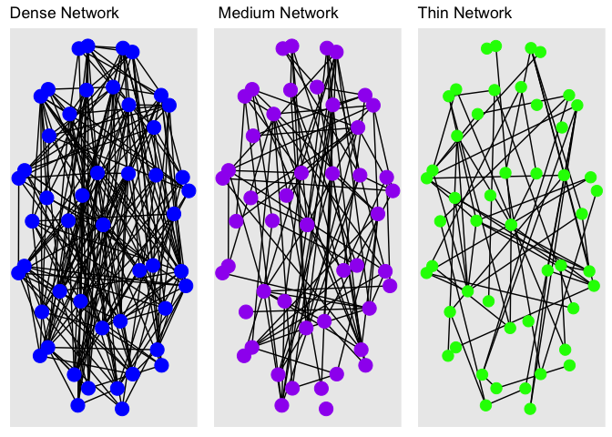
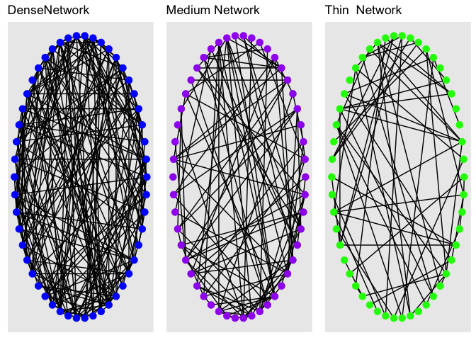

```r
library(igraph)
```

```
## 
## Attaching package: 'igraph'
```

```
## The following objects are masked from 'package:stats':
## 
##     decompose, spectrum
```

```
## The following object is masked from 'package:base':
## 
##     union
```

```r
library(ggplot2)
library(ggraph)
library(igraph)
library(gridExtra)
```


First, make several random networks. A is dense, B is less dense, and C is quite thin. 

```r
sampleA <- erdos.renyi.game(50, 200, type="gnm")
sampleB <- erdos.renyi.game(50, 100, type="gnm")
sampleC <-erdos.renyi.game(50, 60,type="gnm")
```

**Option #1: A Linear Network**

```r
l1<- ggraph(sampleA, layout="linear")+
  geom_edge_arc(width=.3) +
  geom_node_point(size=1, color="blue")+
  ggtitle("Dense Network")

l2<- ggraph(sampleB, layout="linear")+
  geom_edge_arc(width=.3) +
  geom_node_point(size=1, color="purple")+
  ggtitle("Medium Network ")

l3<-ggraph(sampleC, layout="linear")+
  geom_edge_arc(width=.3) +
  geom_node_point(size=1, color="green")+
  ggtitle("Thin Network")

grid.arrange(l1,l2,l3, nrow=1)
```

<!-- -->

**Option #2: Spherical Network**

```r
f1<-ggraph(sampleA, layout="sphere")+
  geom_edge_link() +
  geom_node_point(size= 5, color="blue")+
  ggtitle("Dense Network ")

f2<-ggraph(sampleB, layout="sphere")+
  geom_edge_link() +
  geom_node_point(size=5, color="purple")+
  ggtitle(" Medium Network")

f3<-ggraph(sampleC, layout="sphere")+
  geom_edge_link() +
  geom_node_point(size=4, color="green")+
  ggtitle("Thin Network ")

grid.arrange(f1,f2,f3, nrow=1)
```

<!-- -->


**Option #3: Circle Network**

```r
c1<-ggraph(sampleA, layout="circle")+
  geom_edge_link() +
  geom_node_point(size=3, color="blue")+
  ggtitle("DenseNetwork")
c2<- ggraph(sampleB, layout="circle")+
  geom_edge_link() +
  geom_node_point(size=3, color="purple")+
  ggtitle("Medium Network")
c3 <- ggraph(sampleC, layout="circle")+
  geom_edge_link() +
  geom_node_point(size=3, color="green")+
  ggtitle("Thin  Network")
grid.arrange(c1,c2,c3, nrow=1)
```

<!-- -->


**Questions for Group** 

 - which viz best reveals the difference in density? 
 - What's unclear? 
 - Ways to improve the networks 

