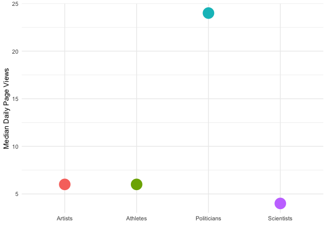
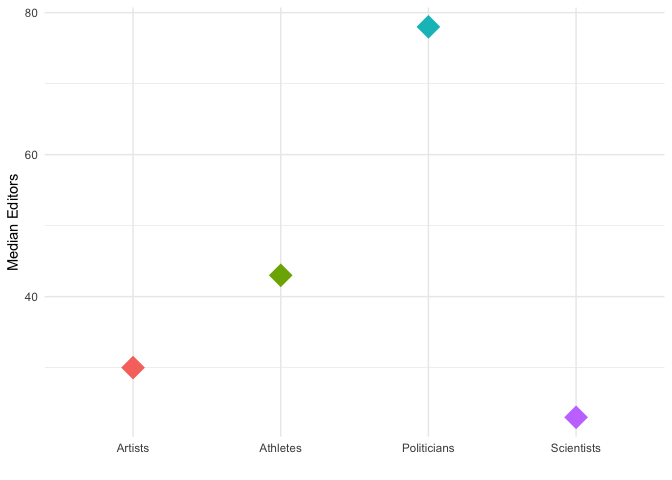

```r
library(tidyverse)
```

```
## ── Attaching packages ─────────────────────────────────────────────────────────────── tidyverse 1.2.1 ──
```

```
## ✔ ggplot2 3.1.1       ✔ purrr   0.3.2  
## ✔ tibble  2.1.1       ✔ dplyr   0.8.0.1
## ✔ tidyr   0.8.3       ✔ stringr 1.4.0  
## ✔ readr   1.3.1       ✔ forcats 0.4.0
```

```
## ── Conflicts ────────────────────────────────────────────────────────────────── tidyverse_conflicts() ──
## ✖ dplyr::filter() masks stats::filter()
## ✖ dplyr::lag()    masks stats::lag()
```

```r
library(readr)
library(igraph)
```

```
## 
## Attaching package: 'igraph'
```

```
## The following objects are masked from 'package:dplyr':
## 
##     as_data_frame, groups, union
```

```
## The following objects are masked from 'package:purrr':
## 
##     compose, simplify
```

```
## The following object is masked from 'package:tidyr':
## 
##     crossing
```

```
## The following object is masked from 'package:tibble':
## 
##     as_data_frame
```

```
## The following objects are masked from 'package:stats':
## 
##     decompose, spectrum
```

```
## The following object is masked from 'package:base':
## 
##     union
```

# Load Data 

```r
Artists<-read.csv("~/Desktop/describing_your_data/wikipedia_api/Data_Sets/artandfemWiki.csv")
Athletes<- read.csv("~/Desktop/describing_your_data/wikipedia_api/Data_Sets/athletesWiki.csv")
Politicians <- read.csv("~/Desktop/describing_your_data/wikipedia_api/Data_Sets/politicsWiki.csv")
Scientists <- read.csv("~/Desktop/describing_your_data/wikipedia_api/Data_Sets/ScientistsWiki.csv")

# Add a column to each for their group 
Artists$type<-"Artists"
Artists<-subset(Artists, select =-X)
Athletes$type<-"Athletes"
Politicians$type <-"Politicians"
Scientists$type<-"Scientists"

# Combine into one data set 
all_data<- rbind(Artists,Athletes,Politicians,Scientists)
head(all_data)
```

```
##                        title
## 1                       A Ge
## 2    A.Z.M. Enayetullah Khan
## 3             A'Lelia Walker
## 4       Abanindranath Tagore
## 5 Abastenia St. Leger Eberle
## 6                Abbie Adams
##                                                                                                                                                                                                                                                                                                                                                                                                                                                                                                                                                                                                              infobox
## 1                                                                                                                                                                                                                                                                                                                  {'name': '阿鸽; Hanyu Pinyin: Ā Gē', 'birth_date': '{{birth year and age|1948}}', 'birth_place': '[[Liangping County|Liangshan]], [[Sichuan]]', 'nationality': 'Chinese', 'field': 'art', 'training': '[[China Artists Association]]', 'spouse': 'Xu Kuang', 'website': 'http://age.artron.net/'}
## 2                                                                                                                            {'name': 'A.Z.M. Enayetullah Khan', 'birth_date': '{{birth date|df|=|yes|1939|5|25}}', 'birth_place': '[[Mymensingh]], [[Bengal Presidency]], [[British India]] (now [[Bangladesh]])', 'death_date': '{{death date and age|df|=|yes|2005|11|10|1939|5|25}}', 'death_place': 'Canada', 'nationality': 'Bangladeshi', 'occupation': 'Journalism', 'known_for': 'Journalist, Former Minister, High Commissioner', 'father': '[[Abdul Jabbar Khan]]', 'awards': '[[Ekushey Padak]] (2004)'}
## 3                                                                                                                 {'name': "A'Lelia Walker", 'birth_name': 'Lelia McWilliams', 'image': "A'Lelia Walker.jpg", 'birth_date': '{{birth date|1885|06|06|mf|=|y}}', 'birth_place': '[[Vicksburg, Mississippi]], United States', 'death_date': '{{death date and age|1931|8|17|1885|06|06|mf|=|y}}', 'death_place': '{{Nowrap|[[Long Branch, New Jersey]], United States}}', 'nationality': 'American', 'occupation': '[[businessperson|Businesswoman]], [[hair care|hair-care]] entrepreneur', 'children': 'Mae Walker'}
## 4 {'name': 'Abanindranath Tagore <br/> অবনীন্দ্রনাথ ঠাকুর', 'image': 'Abanindranath Tagore photo.jpg', 'caption': 'Abanindranath Tagore', 'birth_date': '{{Birth date|df|=|yes|1871|08|07}}', 'birth_place': 'Joransanko, [[Calcutta]], [[Bengal Presidency|Bengal]], [[British India]]', 'death_date': '{{Death date and age|df|=|yes|1951|12|05|1871|08|07}}', 'death_place': '[[Calcutta]]', 'nationality': 'Indian', 'movement': '[[Bengal school of art]], [[Contextual Modernism]]', 'field': 'Painting, writing', 'notable_works': '[[Bharat Mata (Abanindranath)|Bharat Mata]]; [[The Passing of Shah Jahan]]'}
## 5                                                                                                               {'name': 'Abastenia St. Leger Eberle', 'image': 'Abastenia St. Leger Eberle.jpg', 'imagesize': '200px', 'birth_date': 'April 6, 1878', 'birth_place': '[[Webster City, Iowa]], United States', 'death_date': '{{death date and age|1942|2|26|1878|4|6}}', 'death_place': '[[New York City]]', 'nationality': 'American', 'field': 'Sculpture', 'movement': '[[Ashcan School]]<br/>[[New Sculpture]]<br/>[[Realism (arts)|Realism]]', 'works': "''Girl Skating'' (1907)<br/> ''White Slave'' (1913)"}
## 6                                                                                                                                                                                                                                                                                                                                                                                         {'name': 'Abbie Adams', 'birth_name': 'Abbie Miller', 'birth_date': '1980 or 1981', 'nationality': 'American', 'education': 'Goshen College', 'known_for': 'Illustration', 'website': 'https://www.abbieadamsstudio.com/'}
##   length
## 1   3361
## 2   8058
## 3   9926
## 4  15830
## 5  14269
## 6   4233
##                                                                                                                                                                                                                                                                                                                                                                                                                                                                                                                                                                                                                                                                                                                                                                                                                                                                                                                                                                                                                                                                                                                                                                                                                                                                                                                                                                                                                                                                                                                                                                                                                                                                                                                                                                                                                                                                                                                                                                                                                                                                                                                                                                                                                                                                                                                                                                                                                                                                                                                                                                                                                                                                                                                                                                                                                                                                                                        wikilinks
## 1                                                                                                                                                                                                                                                                                                                                                                                                                                                                                                                                                                                                                                                                                                                                                                                                                                                                                                                                                                                                                                                                                                                                                                                                                                                                                                                                                                                                                                                                                                                                                                                                                                                                                                                                                                                                                                                                                                                                                                                                                                                                                                                                                                                                                                                                                                                                                                                                                                                                                                                                                                                                                                                                                    ['British Museum', 'China', 'China Artists Association', 'Hanyu Pinyin', 'International Standard Book Number', 'Liangping County', 'Sichuan', 'Sichuan Fine Arts Institute', 'Simplified Chinese', 'Xu Kuang', 'Yi people']
## 2                                                                                                                                                                                                                                                                                                                                                                                                                                                                                                                                                                                                                                                                                                                                                                                                                                                                                                                                                                                                                                                                                                                                                                                                                                                                                                                                                                                                                                                                                                                                                                                                                                                                                                                                                                                                                                                                                                                                                                                                                                                                 ['Abdul Hamid Khan Bhashani', 'Abdul Jabbar Khan', 'Abu Zafar Obaidullah', 'Ayub Khan (Field Marshal)', 'Bangabandhu Sheikh Mujibur Rahman', 'Bangladesh', 'Bangladesh Independence War', 'Bangladesh Liberation War', 'Bangladesh famine of 1974', 'Bengal Presidency', 'Bengali Language Movement', 'British India', 'Committee for Civil Liberties and Legal Aid', 'Ekushey Padak', 'Farakka Long March', 'Holiday (newspaper)', 'International Standard Name Identifier', 'Jatiyo Rakkhi Bahini', 'Mr Alan Khan', 'Myanmar', 'Mymensingh', 'New Age (Bangladesh)', 'Pakistan', 'Rashed Khan Menon', 'Royal Library of the Netherlands', 'Sadek Khan', 'Selima Rahman', 'Sultan M. Khan', 'Système universitaire de documentation', 'University of Dhaka', 'Virtual International Authority File', 'Weekly Holiday', 'WorldCat Identities']
## 3                                                                                                                                                                                                                                                                                                                                                                                                                                                                                                                                                                                                                                                                                                                                                                                                                                                                                                                                                                                                                                                                                                                                                                                                                                                                                                                                                                                                                                                                                                                                                                                                                                                                                                                                                                                                                                                                                                                                                                         ["A'Lelia Bundles", 'Adam Clayton Powell Sr.', 'Alpha Phi Alpha', 'Atlanta, Georgia', 'Bibliothèque nationale de France', 'Businessperson', 'Enrico Caruso', 'Find a Grave', 'Great Depression', 'Hair care', 'Hubert Julian', 'Hypertension', 'Indianapolis, Indiana', 'International Standard Book Number', 'International Standard Name Identifier', 'Irvington-on-Hudson, New York', 'James Reese Europe', 'Knoxville College', 'Library of Congress Control Number', 'Long Branch, New Jersey', 'Madam C. J. Walker', 'Madame C.J. Walker Manufacturing Company', 'Madame Walker Theatre Center', 'Mary McLeod Bethune', 'OCLC', 'Paul Frankl', 'Prohibition', 'SNAC', 'Spelman College', 'St. Louis, Missouri', 'United States', 'Vertner Tandy', 'Vicksburg, Mississippi', 'Villa Lewaro', 'Virtual International Authority File', 'Wayback Machine', 'Westchester County', 'Woodlawn Cemetery (Bronx)', 'WorldCat Identities']
## 4 ['Academic art', 'Ajanta Caves', 'Amiya Tagore', 'Asian people', 'Asit Kumar Haldar', 'Bengal Presidency', 'Bengal school of art', 'Bengali language', 'Bharat Mata (Abanindranath)', 'Biblioteca Nacional de España', 'Bibliothèque nationale de France', 'Bibsys', 'British India', 'British Raj', 'Calcutta', 'Calcutta School of Art', 'Calligraphy', 'Chinese calligraphy', 'CiNii', 'Companion of the Order of the Indian Empire', 'Contextual Modernism', 'Darpanarayan Tagore', 'Debendranath Tagore', 'Devika Rani', 'Dinendranath Tagore', 'Dwarkanath Tagore', 'Dwijendranath Tagore', 'Ernest Binfield Havell', 'Gaganendranath Tagore', 'Ganendranath Tagore', 'Gitanjali', 'Gnanendramohan Tagore', 'Gopi Mohan Tagore', 'Government College of Art & Craft, Kolkata', 'Gwalior Fort', 'Hara Kumar Tagore', 'Hemendranath Tagore', 'Himanshu Rai', 'Hindu', 'Indian art', 'Indira Devi Chaudhurani', 'Integrated Authority File', 'International Standard Book Number', 'International Standard Name Identifier', 'Internet Archive', 'James McNeill Whistler', 'Japanese calligraphy', 'Jatindramohan Tagore', 'Jitendra Prasada', 'Jitin Prasada', 'Jnanadanandini Devi', 'John Onians', 'Jorasanko', 'Jyotirindranath Tagore', 'K. G. Subramanyan', 'K. Venkatappa', 'Kadambari Devi', 'Kalipada Ghoshal', 'Khirer Putul', 'Kolkata', 'Krishna', 'Krishna Kripalani', 'Krishna Riboud', 'LIBRIS', 'Lakshminath Bezbaroa', 'Library of Congress Control Number', 'List of Nobel laureates', 'London University School of Advanced Study', 'Manishi Dey', 'Modern Indian painting', 'Mrinalini Devi', 'Mughal Empire', 'Mukul Dey', 'MusicBrainz', 'Nandalal Bose', 'National Library of Australia', 'National Library of Israel', 'National Library of Latvia', 'Nilmoni Tagore', 'Okakura Kakuzō', 'Paintings of Abanindranath Tagore', 'Pan-Asianism', 'Pragyasundari Devi', 'Pramatha Chaudhuri', 'Prasanna Coomar Tagore', 'Prasanna Kumar Tagore', 'Pratima Devi (painter)', 'Pre-Raphaelites', 'Prodyot Coomar Tagore', 'Purnima Devi', 'R. Siva Kumar', 'Rabindranath Tagore', 'Rajput', 'Ramanath Tagore', 'Rathindranath Tagore', 'Royal College of Art', 'Royal Library of the Netherlands', 'SNAC', 'Saif Ali Khan', 'Sanskrit College', 'Sara Ali Khan', 'Sarada Ukil', 'Sarala Devi Chaudhurani', 'Saranindranath Tagore', 'Satyendranath Tagore', 'Saumyendranath Tagore', 'Sharmila Tagore', 'Soha Ali Khan', 'Sourindra Mohun Tagore', "St. Xavier's College, Calcutta", 'Sunayani Devi', 'Surendranath Tagore', 'Swadeshi', 'Swarnakumari Devi', 'Système universitaire de documentation', 'Tagore family', 'The Burlington Magazine', 'The Passing of Shah Jahan', 'Theosophy (Blavatskian)', 'Trove', 'Union List of Artist Names', 'Varanasi', 'Virtual International Authority File', 'Western culture', 'William Rothenstein', 'WorldCat Identities', 'Yokoyama Taikan']
## 5                                                                                                                                                                                                                                                                                                                                                                                                                                                                                                                                                                                                                                                                                                                                                                                                                                                                                                                                                                                                                                                                                                                                                                                                                                                                                                                                                                                                                                                                                                                                                                                                                                                                                                                                                                                                                                                                                                                                                       ['Anna Hyatt Huntington', 'Armory Show', 'Art Nouveau', 'Art Students League of New York', 'Art competitions at the 1928 Summer Olympics', 'Art competitions at the 1932 Summer Olympics', 'Ashcan School', 'Bronze', 'Canton, Ohio', 'Child prostitution', 'Fountain', 'George Grey Barnard', 'Integrated Authority File', 'International Standard Book Number', 'International Standard Name Identifier', 'Jane Addams', 'Library of Congress Control Number', 'Lower East Side', 'Metropolitan Museum of Art', 'National Academy of Design', 'National Sculpture Society', 'Netherlands Institute for Art History', 'New Sculpture', 'New York City', 'Realism (arts)', 'SNAC', 'Sculptor', 'Sexual slavery', 'Society of American Artists', 'Susan P. Casteras', 'Union List of Artist Names', 'United States', 'Virtual International Authority File', 'Webster City, Iowa', 'Westport, Connecticut', "Woman's Art Journal", 'WorldCat Identities']
## 6                                                                                                                                                                                                                                                                                                                                                                                                                                                                                                                                                                                                                                                                                                                                                                                                                                                                                                                                                                                                                                                                                                                                                                                                                                                                                                                                                                                                                                                                                                                                                                                                                                                                                                                                                                                                                                                                                                                                                                                                                                                                                                                                                                                                                                                                                                                                                                                                                                                                                                                                                                                ['Carbondale, Colorado', 'Clarkston, Washington', 'Douglas, Arizona', 'England', 'Google Street View', 'Goshen College', 'Goshen, Indiana', 'Indiana', 'London', 'Los Angeles', 'New Orleans', 'New York City', 'Newport, Tennessee', 'Nonprofit organization', 'Pennsylvania', 'Peru', 'Pittsburgh', 'Spain', 'Wellman, Iowa']
##   editorcount   pageID aveviews
## 1          38 32498719        7
## 2          33 40903545       12
## 3         173  2626290      113
## 4         216  1877539      281
## 5          62  6569225       25
## 6           7 49617819        1
##                                                                                                                                                                                                                                                                                                                                                                                                                                                                                                                                                                                                                                                                                                                                                                                                              categories
## 1                                                                                                                                                                                                                                                                                                                                                                                                                                                                                                                                                                                ['Category:1948 births', 'Category:20th-century Chinese artists', 'Category:20th-century women artists', 'Category:Artists from Sichuan', 'Category:Chinese artist stubs', 'Category:Living people', 'Category:People from Liangshan']
## 2                                                                                                                                                                                                                                                                                                                                                                                                                                                                                   ['Category:1939 births', 'Category:2005 deaths', 'Category:Bangladesh Nationalist Party politicians', 'Category:Bangladeshi journalists', 'Category:Deaths from cancer in Ontario', 'Category:Deaths from pancreatic cancer', 'Category:Power, Energy and Mineral Resources ministers', 'Category:Recipients of the Ekushey Padak']
## 3                                                                                                                                                                                                                                                                                                                                                                                                                                                                                             ['Category:1885 births', 'Category:1931 deaths', 'Category:20th-century American businesspeople', 'Category:African-American businesspeople', 'Category:American socialites', 'Category:American women in business', 'Category:Deaths from hypertension', 'Category:Madam C. J. Walker', 'Category:Women art collectors']
## 4 ['Category:1871 births', 'Category:1951 deaths', 'Category:20th-century Indian male writers', 'Category:20th-century Indian novelists', 'Category:20th-century Indian painters', 'Category:Artists from Kolkata', 'Category:Bengali-language writers', 'Category:Buddhist artists', 'Category:Companions of the Order of the Indian Empire', 'Category:Government College of Art & Craft alumni', 'Category:Indian arts administrators', "Category:Indian children's writers", 'Category:Indian male painters', 'Category:Indian portrait painters', 'Category:Novelists from West Bengal', 'Category:Painters from West Bengal', 'Category:Sanskrit College alumni', 'Category:Tagore family', 'Category:University of Calcutta alumni', 'Category:University of Calcutta faculty', 'Category:Writers from Kolkata']
## 5                                                                                                                                                                                                                                                                                                                                                           ['Category:1878 births', 'Category:1942 deaths', 'Category:20th-century American sculptors', 'Category:20th-century American women artists', 'Category:Art Nouveau sculptors', 'Category:Art Students League of New York alumni', 'Category:National Sculpture Society members', 'Category:Olympic competitors in art competitions', 'Category:People from Webster City, Iowa', 'Category:Sculptors from Iowa', 'Category:Sculptors from New York (state)']
## 6                                                                                                                                                                                                                                                                                                                                                                                                                                                         ['Category:1980s births', 'Category:20th-century American artists', 'Category:20th-century American women artists', 'Category:21st-century American artists', 'Category:21st-century American women artists', 'Category:Artists from Pittsburgh', 'Category:Goshen College alumni', 'Category:Living people', 'Category:People from Washington County, Iowa']
##      type
## 1 Artists
## 2 Artists
## 3 Artists
## 4 Artists
## 5 Artists
## 6 Artists
```

```r
head(Artists)
```

```
##                        title
## 1                       A Ge
## 2    A.Z.M. Enayetullah Khan
## 3             A'Lelia Walker
## 4       Abanindranath Tagore
## 5 Abastenia St. Leger Eberle
## 6                Abbie Adams
##                                                                                                                                                                                                                                                                                                                                                                                                                                                                                                                                                                                                              infobox
## 1                                                                                                                                                                                                                                                                                                                  {'name': '阿鸽; Hanyu Pinyin: Ā Gē', 'birth_date': '{{birth year and age|1948}}', 'birth_place': '[[Liangping County|Liangshan]], [[Sichuan]]', 'nationality': 'Chinese', 'field': 'art', 'training': '[[China Artists Association]]', 'spouse': 'Xu Kuang', 'website': 'http://age.artron.net/'}
## 2                                                                                                                            {'name': 'A.Z.M. Enayetullah Khan', 'birth_date': '{{birth date|df|=|yes|1939|5|25}}', 'birth_place': '[[Mymensingh]], [[Bengal Presidency]], [[British India]] (now [[Bangladesh]])', 'death_date': '{{death date and age|df|=|yes|2005|11|10|1939|5|25}}', 'death_place': 'Canada', 'nationality': 'Bangladeshi', 'occupation': 'Journalism', 'known_for': 'Journalist, Former Minister, High Commissioner', 'father': '[[Abdul Jabbar Khan]]', 'awards': '[[Ekushey Padak]] (2004)'}
## 3                                                                                                                 {'name': "A'Lelia Walker", 'birth_name': 'Lelia McWilliams', 'image': "A'Lelia Walker.jpg", 'birth_date': '{{birth date|1885|06|06|mf|=|y}}', 'birth_place': '[[Vicksburg, Mississippi]], United States', 'death_date': '{{death date and age|1931|8|17|1885|06|06|mf|=|y}}', 'death_place': '{{Nowrap|[[Long Branch, New Jersey]], United States}}', 'nationality': 'American', 'occupation': '[[businessperson|Businesswoman]], [[hair care|hair-care]] entrepreneur', 'children': 'Mae Walker'}
## 4 {'name': 'Abanindranath Tagore <br/> অবনীন্দ্রনাথ ঠাকুর', 'image': 'Abanindranath Tagore photo.jpg', 'caption': 'Abanindranath Tagore', 'birth_date': '{{Birth date|df|=|yes|1871|08|07}}', 'birth_place': 'Joransanko, [[Calcutta]], [[Bengal Presidency|Bengal]], [[British India]]', 'death_date': '{{Death date and age|df|=|yes|1951|12|05|1871|08|07}}', 'death_place': '[[Calcutta]]', 'nationality': 'Indian', 'movement': '[[Bengal school of art]], [[Contextual Modernism]]', 'field': 'Painting, writing', 'notable_works': '[[Bharat Mata (Abanindranath)|Bharat Mata]]; [[The Passing of Shah Jahan]]'}
## 5                                                                                                               {'name': 'Abastenia St. Leger Eberle', 'image': 'Abastenia St. Leger Eberle.jpg', 'imagesize': '200px', 'birth_date': 'April 6, 1878', 'birth_place': '[[Webster City, Iowa]], United States', 'death_date': '{{death date and age|1942|2|26|1878|4|6}}', 'death_place': '[[New York City]]', 'nationality': 'American', 'field': 'Sculpture', 'movement': '[[Ashcan School]]<br/>[[New Sculpture]]<br/>[[Realism (arts)|Realism]]', 'works': "''Girl Skating'' (1907)<br/> ''White Slave'' (1913)"}
## 6                                                                                                                                                                                                                                                                                                                                                                                         {'name': 'Abbie Adams', 'birth_name': 'Abbie Miller', 'birth_date': '1980 or 1981', 'nationality': 'American', 'education': 'Goshen College', 'known_for': 'Illustration', 'website': 'https://www.abbieadamsstudio.com/'}
##   length
## 1   3361
## 2   8058
## 3   9926
## 4  15830
## 5  14269
## 6   4233
##                                                                                                                                                                                                                                                                                                                                                                                                                                                                                                                                                                                                                                                                                                                                                                                                                                                                                                                                                                                                                                                                                                                                                                                                                                                                                                                                                                                                                                                                                                                                                                                                                                                                                                                                                                                                                                                                                                                                                                                                                                                                                                                                                                                                                                                                                                                                                                                                                                                                                                                                                                                                                                                                                                                                                                                                                                                                                                        wikilinks
## 1                                                                                                                                                                                                                                                                                                                                                                                                                                                                                                                                                                                                                                                                                                                                                                                                                                                                                                                                                                                                                                                                                                                                                                                                                                                                                                                                                                                                                                                                                                                                                                                                                                                                                                                                                                                                                                                                                                                                                                                                                                                                                                                                                                                                                                                                                                                                                                                                                                                                                                                                                                                                                                                                                    ['British Museum', 'China', 'China Artists Association', 'Hanyu Pinyin', 'International Standard Book Number', 'Liangping County', 'Sichuan', 'Sichuan Fine Arts Institute', 'Simplified Chinese', 'Xu Kuang', 'Yi people']
## 2                                                                                                                                                                                                                                                                                                                                                                                                                                                                                                                                                                                                                                                                                                                                                                                                                                                                                                                                                                                                                                                                                                                                                                                                                                                                                                                                                                                                                                                                                                                                                                                                                                                                                                                                                                                                                                                                                                                                                                                                                                                                 ['Abdul Hamid Khan Bhashani', 'Abdul Jabbar Khan', 'Abu Zafar Obaidullah', 'Ayub Khan (Field Marshal)', 'Bangabandhu Sheikh Mujibur Rahman', 'Bangladesh', 'Bangladesh Independence War', 'Bangladesh Liberation War', 'Bangladesh famine of 1974', 'Bengal Presidency', 'Bengali Language Movement', 'British India', 'Committee for Civil Liberties and Legal Aid', 'Ekushey Padak', 'Farakka Long March', 'Holiday (newspaper)', 'International Standard Name Identifier', 'Jatiyo Rakkhi Bahini', 'Mr Alan Khan', 'Myanmar', 'Mymensingh', 'New Age (Bangladesh)', 'Pakistan', 'Rashed Khan Menon', 'Royal Library of the Netherlands', 'Sadek Khan', 'Selima Rahman', 'Sultan M. Khan', 'Système universitaire de documentation', 'University of Dhaka', 'Virtual International Authority File', 'Weekly Holiday', 'WorldCat Identities']
## 3                                                                                                                                                                                                                                                                                                                                                                                                                                                                                                                                                                                                                                                                                                                                                                                                                                                                                                                                                                                                                                                                                                                                                                                                                                                                                                                                                                                                                                                                                                                                                                                                                                                                                                                                                                                                                                                                                                                                                                         ["A'Lelia Bundles", 'Adam Clayton Powell Sr.', 'Alpha Phi Alpha', 'Atlanta, Georgia', 'Bibliothèque nationale de France', 'Businessperson', 'Enrico Caruso', 'Find a Grave', 'Great Depression', 'Hair care', 'Hubert Julian', 'Hypertension', 'Indianapolis, Indiana', 'International Standard Book Number', 'International Standard Name Identifier', 'Irvington-on-Hudson, New York', 'James Reese Europe', 'Knoxville College', 'Library of Congress Control Number', 'Long Branch, New Jersey', 'Madam C. J. Walker', 'Madame C.J. Walker Manufacturing Company', 'Madame Walker Theatre Center', 'Mary McLeod Bethune', 'OCLC', 'Paul Frankl', 'Prohibition', 'SNAC', 'Spelman College', 'St. Louis, Missouri', 'United States', 'Vertner Tandy', 'Vicksburg, Mississippi', 'Villa Lewaro', 'Virtual International Authority File', 'Wayback Machine', 'Westchester County', 'Woodlawn Cemetery (Bronx)', 'WorldCat Identities']
## 4 ['Academic art', 'Ajanta Caves', 'Amiya Tagore', 'Asian people', 'Asit Kumar Haldar', 'Bengal Presidency', 'Bengal school of art', 'Bengali language', 'Bharat Mata (Abanindranath)', 'Biblioteca Nacional de España', 'Bibliothèque nationale de France', 'Bibsys', 'British India', 'British Raj', 'Calcutta', 'Calcutta School of Art', 'Calligraphy', 'Chinese calligraphy', 'CiNii', 'Companion of the Order of the Indian Empire', 'Contextual Modernism', 'Darpanarayan Tagore', 'Debendranath Tagore', 'Devika Rani', 'Dinendranath Tagore', 'Dwarkanath Tagore', 'Dwijendranath Tagore', 'Ernest Binfield Havell', 'Gaganendranath Tagore', 'Ganendranath Tagore', 'Gitanjali', 'Gnanendramohan Tagore', 'Gopi Mohan Tagore', 'Government College of Art & Craft, Kolkata', 'Gwalior Fort', 'Hara Kumar Tagore', 'Hemendranath Tagore', 'Himanshu Rai', 'Hindu', 'Indian art', 'Indira Devi Chaudhurani', 'Integrated Authority File', 'International Standard Book Number', 'International Standard Name Identifier', 'Internet Archive', 'James McNeill Whistler', 'Japanese calligraphy', 'Jatindramohan Tagore', 'Jitendra Prasada', 'Jitin Prasada', 'Jnanadanandini Devi', 'John Onians', 'Jorasanko', 'Jyotirindranath Tagore', 'K. G. Subramanyan', 'K. Venkatappa', 'Kadambari Devi', 'Kalipada Ghoshal', 'Khirer Putul', 'Kolkata', 'Krishna', 'Krishna Kripalani', 'Krishna Riboud', 'LIBRIS', 'Lakshminath Bezbaroa', 'Library of Congress Control Number', 'List of Nobel laureates', 'London University School of Advanced Study', 'Manishi Dey', 'Modern Indian painting', 'Mrinalini Devi', 'Mughal Empire', 'Mukul Dey', 'MusicBrainz', 'Nandalal Bose', 'National Library of Australia', 'National Library of Israel', 'National Library of Latvia', 'Nilmoni Tagore', 'Okakura Kakuzō', 'Paintings of Abanindranath Tagore', 'Pan-Asianism', 'Pragyasundari Devi', 'Pramatha Chaudhuri', 'Prasanna Coomar Tagore', 'Prasanna Kumar Tagore', 'Pratima Devi (painter)', 'Pre-Raphaelites', 'Prodyot Coomar Tagore', 'Purnima Devi', 'R. Siva Kumar', 'Rabindranath Tagore', 'Rajput', 'Ramanath Tagore', 'Rathindranath Tagore', 'Royal College of Art', 'Royal Library of the Netherlands', 'SNAC', 'Saif Ali Khan', 'Sanskrit College', 'Sara Ali Khan', 'Sarada Ukil', 'Sarala Devi Chaudhurani', 'Saranindranath Tagore', 'Satyendranath Tagore', 'Saumyendranath Tagore', 'Sharmila Tagore', 'Soha Ali Khan', 'Sourindra Mohun Tagore', "St. Xavier's College, Calcutta", 'Sunayani Devi', 'Surendranath Tagore', 'Swadeshi', 'Swarnakumari Devi', 'Système universitaire de documentation', 'Tagore family', 'The Burlington Magazine', 'The Passing of Shah Jahan', 'Theosophy (Blavatskian)', 'Trove', 'Union List of Artist Names', 'Varanasi', 'Virtual International Authority File', 'Western culture', 'William Rothenstein', 'WorldCat Identities', 'Yokoyama Taikan']
## 5                                                                                                                                                                                                                                                                                                                                                                                                                                                                                                                                                                                                                                                                                                                                                                                                                                                                                                                                                                                                                                                                                                                                                                                                                                                                                                                                                                                                                                                                                                                                                                                                                                                                                                                                                                                                                                                                                                                                                       ['Anna Hyatt Huntington', 'Armory Show', 'Art Nouveau', 'Art Students League of New York', 'Art competitions at the 1928 Summer Olympics', 'Art competitions at the 1932 Summer Olympics', 'Ashcan School', 'Bronze', 'Canton, Ohio', 'Child prostitution', 'Fountain', 'George Grey Barnard', 'Integrated Authority File', 'International Standard Book Number', 'International Standard Name Identifier', 'Jane Addams', 'Library of Congress Control Number', 'Lower East Side', 'Metropolitan Museum of Art', 'National Academy of Design', 'National Sculpture Society', 'Netherlands Institute for Art History', 'New Sculpture', 'New York City', 'Realism (arts)', 'SNAC', 'Sculptor', 'Sexual slavery', 'Society of American Artists', 'Susan P. Casteras', 'Union List of Artist Names', 'United States', 'Virtual International Authority File', 'Webster City, Iowa', 'Westport, Connecticut', "Woman's Art Journal", 'WorldCat Identities']
## 6                                                                                                                                                                                                                                                                                                                                                                                                                                                                                                                                                                                                                                                                                                                                                                                                                                                                                                                                                                                                                                                                                                                                                                                                                                                                                                                                                                                                                                                                                                                                                                                                                                                                                                                                                                                                                                                                                                                                                                                                                                                                                                                                                                                                                                                                                                                                                                                                                                                                                                                                                                                ['Carbondale, Colorado', 'Clarkston, Washington', 'Douglas, Arizona', 'England', 'Google Street View', 'Goshen College', 'Goshen, Indiana', 'Indiana', 'London', 'Los Angeles', 'New Orleans', 'New York City', 'Newport, Tennessee', 'Nonprofit organization', 'Pennsylvania', 'Peru', 'Pittsburgh', 'Spain', 'Wellman, Iowa']
##   editorcount   pageID aveviews
## 1          38 32498719        7
## 2          33 40903545       12
## 3         173  2626290      113
## 4         216  1877539      281
## 5          62  6569225       25
## 6           7 49617819        1
##                                                                                                                                                                                                                                                                                                                                                                                                                                                                                                                                                                                                                                                                                                                                                                                                              categories
## 1                                                                                                                                                                                                                                                                                                                                                                                                                                                                                                                                                                                ['Category:1948 births', 'Category:20th-century Chinese artists', 'Category:20th-century women artists', 'Category:Artists from Sichuan', 'Category:Chinese artist stubs', 'Category:Living people', 'Category:People from Liangshan']
## 2                                                                                                                                                                                                                                                                                                                                                                                                                                                                                   ['Category:1939 births', 'Category:2005 deaths', 'Category:Bangladesh Nationalist Party politicians', 'Category:Bangladeshi journalists', 'Category:Deaths from cancer in Ontario', 'Category:Deaths from pancreatic cancer', 'Category:Power, Energy and Mineral Resources ministers', 'Category:Recipients of the Ekushey Padak']
## 3                                                                                                                                                                                                                                                                                                                                                                                                                                                                                             ['Category:1885 births', 'Category:1931 deaths', 'Category:20th-century American businesspeople', 'Category:African-American businesspeople', 'Category:American socialites', 'Category:American women in business', 'Category:Deaths from hypertension', 'Category:Madam C. J. Walker', 'Category:Women art collectors']
## 4 ['Category:1871 births', 'Category:1951 deaths', 'Category:20th-century Indian male writers', 'Category:20th-century Indian novelists', 'Category:20th-century Indian painters', 'Category:Artists from Kolkata', 'Category:Bengali-language writers', 'Category:Buddhist artists', 'Category:Companions of the Order of the Indian Empire', 'Category:Government College of Art & Craft alumni', 'Category:Indian arts administrators', "Category:Indian children's writers", 'Category:Indian male painters', 'Category:Indian portrait painters', 'Category:Novelists from West Bengal', 'Category:Painters from West Bengal', 'Category:Sanskrit College alumni', 'Category:Tagore family', 'Category:University of Calcutta alumni', 'Category:University of Calcutta faculty', 'Category:Writers from Kolkata']
## 5                                                                                                                                                                                                                                                                                                                                                           ['Category:1878 births', 'Category:1942 deaths', 'Category:20th-century American sculptors', 'Category:20th-century American women artists', 'Category:Art Nouveau sculptors', 'Category:Art Students League of New York alumni', 'Category:National Sculpture Society members', 'Category:Olympic competitors in art competitions', 'Category:People from Webster City, Iowa', 'Category:Sculptors from Iowa', 'Category:Sculptors from New York (state)']
## 6                                                                                                                                                                                                                                                                                                                                                                                                                                                         ['Category:1980s births', 'Category:20th-century American artists', 'Category:20th-century American women artists', 'Category:21st-century American artists', 'Category:21st-century American women artists', 'Category:Artists from Pittsburgh', 'Category:Goshen College alumni', 'Category:Living people', 'Category:People from Washington County, Iowa']
##      type
## 1 Artists
## 2 Artists
## 3 Artists
## 4 Artists
## 5 Artists
## 6 Artists
```

```r
all_data_df<-as.data.frame(all_data)
head(all_data_df)
```

```
##                        title
## 1                       A Ge
## 2    A.Z.M. Enayetullah Khan
## 3             A'Lelia Walker
## 4       Abanindranath Tagore
## 5 Abastenia St. Leger Eberle
## 6                Abbie Adams
##                                                                                                                                                                                                                                                                                                                                                                                                                                                                                                                                                                                                              infobox
## 1                                                                                                                                                                                                                                                                                                                  {'name': '阿鸽; Hanyu Pinyin: Ā Gē', 'birth_date': '{{birth year and age|1948}}', 'birth_place': '[[Liangping County|Liangshan]], [[Sichuan]]', 'nationality': 'Chinese', 'field': 'art', 'training': '[[China Artists Association]]', 'spouse': 'Xu Kuang', 'website': 'http://age.artron.net/'}
## 2                                                                                                                            {'name': 'A.Z.M. Enayetullah Khan', 'birth_date': '{{birth date|df|=|yes|1939|5|25}}', 'birth_place': '[[Mymensingh]], [[Bengal Presidency]], [[British India]] (now [[Bangladesh]])', 'death_date': '{{death date and age|df|=|yes|2005|11|10|1939|5|25}}', 'death_place': 'Canada', 'nationality': 'Bangladeshi', 'occupation': 'Journalism', 'known_for': 'Journalist, Former Minister, High Commissioner', 'father': '[[Abdul Jabbar Khan]]', 'awards': '[[Ekushey Padak]] (2004)'}
## 3                                                                                                                 {'name': "A'Lelia Walker", 'birth_name': 'Lelia McWilliams', 'image': "A'Lelia Walker.jpg", 'birth_date': '{{birth date|1885|06|06|mf|=|y}}', 'birth_place': '[[Vicksburg, Mississippi]], United States', 'death_date': '{{death date and age|1931|8|17|1885|06|06|mf|=|y}}', 'death_place': '{{Nowrap|[[Long Branch, New Jersey]], United States}}', 'nationality': 'American', 'occupation': '[[businessperson|Businesswoman]], [[hair care|hair-care]] entrepreneur', 'children': 'Mae Walker'}
## 4 {'name': 'Abanindranath Tagore <br/> অবনীন্দ্রনাথ ঠাকুর', 'image': 'Abanindranath Tagore photo.jpg', 'caption': 'Abanindranath Tagore', 'birth_date': '{{Birth date|df|=|yes|1871|08|07}}', 'birth_place': 'Joransanko, [[Calcutta]], [[Bengal Presidency|Bengal]], [[British India]]', 'death_date': '{{Death date and age|df|=|yes|1951|12|05|1871|08|07}}', 'death_place': '[[Calcutta]]', 'nationality': 'Indian', 'movement': '[[Bengal school of art]], [[Contextual Modernism]]', 'field': 'Painting, writing', 'notable_works': '[[Bharat Mata (Abanindranath)|Bharat Mata]]; [[The Passing of Shah Jahan]]'}
## 5                                                                                                               {'name': 'Abastenia St. Leger Eberle', 'image': 'Abastenia St. Leger Eberle.jpg', 'imagesize': '200px', 'birth_date': 'April 6, 1878', 'birth_place': '[[Webster City, Iowa]], United States', 'death_date': '{{death date and age|1942|2|26|1878|4|6}}', 'death_place': '[[New York City]]', 'nationality': 'American', 'field': 'Sculpture', 'movement': '[[Ashcan School]]<br/>[[New Sculpture]]<br/>[[Realism (arts)|Realism]]', 'works': "''Girl Skating'' (1907)<br/> ''White Slave'' (1913)"}
## 6                                                                                                                                                                                                                                                                                                                                                                                         {'name': 'Abbie Adams', 'birth_name': 'Abbie Miller', 'birth_date': '1980 or 1981', 'nationality': 'American', 'education': 'Goshen College', 'known_for': 'Illustration', 'website': 'https://www.abbieadamsstudio.com/'}
##   length
## 1   3361
## 2   8058
## 3   9926
## 4  15830
## 5  14269
## 6   4233
##                                                                                                                                                                                                                                                                                                                                                                                                                                                                                                                                                                                                                                                                                                                                                                                                                                                                                                                                                                                                                                                                                                                                                                                                                                                                                                                                                                                                                                                                                                                                                                                                                                                                                                                                                                                                                                                                                                                                                                                                                                                                                                                                                                                                                                                                                                                                                                                                                                                                                                                                                                                                                                                                                                                                                                                                                                                                                                        wikilinks
## 1                                                                                                                                                                                                                                                                                                                                                                                                                                                                                                                                                                                                                                                                                                                                                                                                                                                                                                                                                                                                                                                                                                                                                                                                                                                                                                                                                                                                                                                                                                                                                                                                                                                                                                                                                                                                                                                                                                                                                                                                                                                                                                                                                                                                                                                                                                                                                                                                                                                                                                                                                                                                                                                                                    ['British Museum', 'China', 'China Artists Association', 'Hanyu Pinyin', 'International Standard Book Number', 'Liangping County', 'Sichuan', 'Sichuan Fine Arts Institute', 'Simplified Chinese', 'Xu Kuang', 'Yi people']
## 2                                                                                                                                                                                                                                                                                                                                                                                                                                                                                                                                                                                                                                                                                                                                                                                                                                                                                                                                                                                                                                                                                                                                                                                                                                                                                                                                                                                                                                                                                                                                                                                                                                                                                                                                                                                                                                                                                                                                                                                                                                                                 ['Abdul Hamid Khan Bhashani', 'Abdul Jabbar Khan', 'Abu Zafar Obaidullah', 'Ayub Khan (Field Marshal)', 'Bangabandhu Sheikh Mujibur Rahman', 'Bangladesh', 'Bangladesh Independence War', 'Bangladesh Liberation War', 'Bangladesh famine of 1974', 'Bengal Presidency', 'Bengali Language Movement', 'British India', 'Committee for Civil Liberties and Legal Aid', 'Ekushey Padak', 'Farakka Long March', 'Holiday (newspaper)', 'International Standard Name Identifier', 'Jatiyo Rakkhi Bahini', 'Mr Alan Khan', 'Myanmar', 'Mymensingh', 'New Age (Bangladesh)', 'Pakistan', 'Rashed Khan Menon', 'Royal Library of the Netherlands', 'Sadek Khan', 'Selima Rahman', 'Sultan M. Khan', 'Système universitaire de documentation', 'University of Dhaka', 'Virtual International Authority File', 'Weekly Holiday', 'WorldCat Identities']
## 3                                                                                                                                                                                                                                                                                                                                                                                                                                                                                                                                                                                                                                                                                                                                                                                                                                                                                                                                                                                                                                                                                                                                                                                                                                                                                                                                                                                                                                                                                                                                                                                                                                                                                                                                                                                                                                                                                                                                                                         ["A'Lelia Bundles", 'Adam Clayton Powell Sr.', 'Alpha Phi Alpha', 'Atlanta, Georgia', 'Bibliothèque nationale de France', 'Businessperson', 'Enrico Caruso', 'Find a Grave', 'Great Depression', 'Hair care', 'Hubert Julian', 'Hypertension', 'Indianapolis, Indiana', 'International Standard Book Number', 'International Standard Name Identifier', 'Irvington-on-Hudson, New York', 'James Reese Europe', 'Knoxville College', 'Library of Congress Control Number', 'Long Branch, New Jersey', 'Madam C. J. Walker', 'Madame C.J. Walker Manufacturing Company', 'Madame Walker Theatre Center', 'Mary McLeod Bethune', 'OCLC', 'Paul Frankl', 'Prohibition', 'SNAC', 'Spelman College', 'St. Louis, Missouri', 'United States', 'Vertner Tandy', 'Vicksburg, Mississippi', 'Villa Lewaro', 'Virtual International Authority File', 'Wayback Machine', 'Westchester County', 'Woodlawn Cemetery (Bronx)', 'WorldCat Identities']
## 4 ['Academic art', 'Ajanta Caves', 'Amiya Tagore', 'Asian people', 'Asit Kumar Haldar', 'Bengal Presidency', 'Bengal school of art', 'Bengali language', 'Bharat Mata (Abanindranath)', 'Biblioteca Nacional de España', 'Bibliothèque nationale de France', 'Bibsys', 'British India', 'British Raj', 'Calcutta', 'Calcutta School of Art', 'Calligraphy', 'Chinese calligraphy', 'CiNii', 'Companion of the Order of the Indian Empire', 'Contextual Modernism', 'Darpanarayan Tagore', 'Debendranath Tagore', 'Devika Rani', 'Dinendranath Tagore', 'Dwarkanath Tagore', 'Dwijendranath Tagore', 'Ernest Binfield Havell', 'Gaganendranath Tagore', 'Ganendranath Tagore', 'Gitanjali', 'Gnanendramohan Tagore', 'Gopi Mohan Tagore', 'Government College of Art & Craft, Kolkata', 'Gwalior Fort', 'Hara Kumar Tagore', 'Hemendranath Tagore', 'Himanshu Rai', 'Hindu', 'Indian art', 'Indira Devi Chaudhurani', 'Integrated Authority File', 'International Standard Book Number', 'International Standard Name Identifier', 'Internet Archive', 'James McNeill Whistler', 'Japanese calligraphy', 'Jatindramohan Tagore', 'Jitendra Prasada', 'Jitin Prasada', 'Jnanadanandini Devi', 'John Onians', 'Jorasanko', 'Jyotirindranath Tagore', 'K. G. Subramanyan', 'K. Venkatappa', 'Kadambari Devi', 'Kalipada Ghoshal', 'Khirer Putul', 'Kolkata', 'Krishna', 'Krishna Kripalani', 'Krishna Riboud', 'LIBRIS', 'Lakshminath Bezbaroa', 'Library of Congress Control Number', 'List of Nobel laureates', 'London University School of Advanced Study', 'Manishi Dey', 'Modern Indian painting', 'Mrinalini Devi', 'Mughal Empire', 'Mukul Dey', 'MusicBrainz', 'Nandalal Bose', 'National Library of Australia', 'National Library of Israel', 'National Library of Latvia', 'Nilmoni Tagore', 'Okakura Kakuzō', 'Paintings of Abanindranath Tagore', 'Pan-Asianism', 'Pragyasundari Devi', 'Pramatha Chaudhuri', 'Prasanna Coomar Tagore', 'Prasanna Kumar Tagore', 'Pratima Devi (painter)', 'Pre-Raphaelites', 'Prodyot Coomar Tagore', 'Purnima Devi', 'R. Siva Kumar', 'Rabindranath Tagore', 'Rajput', 'Ramanath Tagore', 'Rathindranath Tagore', 'Royal College of Art', 'Royal Library of the Netherlands', 'SNAC', 'Saif Ali Khan', 'Sanskrit College', 'Sara Ali Khan', 'Sarada Ukil', 'Sarala Devi Chaudhurani', 'Saranindranath Tagore', 'Satyendranath Tagore', 'Saumyendranath Tagore', 'Sharmila Tagore', 'Soha Ali Khan', 'Sourindra Mohun Tagore', "St. Xavier's College, Calcutta", 'Sunayani Devi', 'Surendranath Tagore', 'Swadeshi', 'Swarnakumari Devi', 'Système universitaire de documentation', 'Tagore family', 'The Burlington Magazine', 'The Passing of Shah Jahan', 'Theosophy (Blavatskian)', 'Trove', 'Union List of Artist Names', 'Varanasi', 'Virtual International Authority File', 'Western culture', 'William Rothenstein', 'WorldCat Identities', 'Yokoyama Taikan']
## 5                                                                                                                                                                                                                                                                                                                                                                                                                                                                                                                                                                                                                                                                                                                                                                                                                                                                                                                                                                                                                                                                                                                                                                                                                                                                                                                                                                                                                                                                                                                                                                                                                                                                                                                                                                                                                                                                                                                                                       ['Anna Hyatt Huntington', 'Armory Show', 'Art Nouveau', 'Art Students League of New York', 'Art competitions at the 1928 Summer Olympics', 'Art competitions at the 1932 Summer Olympics', 'Ashcan School', 'Bronze', 'Canton, Ohio', 'Child prostitution', 'Fountain', 'George Grey Barnard', 'Integrated Authority File', 'International Standard Book Number', 'International Standard Name Identifier', 'Jane Addams', 'Library of Congress Control Number', 'Lower East Side', 'Metropolitan Museum of Art', 'National Academy of Design', 'National Sculpture Society', 'Netherlands Institute for Art History', 'New Sculpture', 'New York City', 'Realism (arts)', 'SNAC', 'Sculptor', 'Sexual slavery', 'Society of American Artists', 'Susan P. Casteras', 'Union List of Artist Names', 'United States', 'Virtual International Authority File', 'Webster City, Iowa', 'Westport, Connecticut', "Woman's Art Journal", 'WorldCat Identities']
## 6                                                                                                                                                                                                                                                                                                                                                                                                                                                                                                                                                                                                                                                                                                                                                                                                                                                                                                                                                                                                                                                                                                                                                                                                                                                                                                                                                                                                                                                                                                                                                                                                                                                                                                                                                                                                                                                                                                                                                                                                                                                                                                                                                                                                                                                                                                                                                                                                                                                                                                                                                                                ['Carbondale, Colorado', 'Clarkston, Washington', 'Douglas, Arizona', 'England', 'Google Street View', 'Goshen College', 'Goshen, Indiana', 'Indiana', 'London', 'Los Angeles', 'New Orleans', 'New York City', 'Newport, Tennessee', 'Nonprofit organization', 'Pennsylvania', 'Peru', 'Pittsburgh', 'Spain', 'Wellman, Iowa']
##   editorcount   pageID aveviews
## 1          38 32498719        7
## 2          33 40903545       12
## 3         173  2626290      113
## 4         216  1877539      281
## 5          62  6569225       25
## 6           7 49617819        1
##                                                                                                                                                                                                                                                                                                                                                                                                                                                                                                                                                                                                                                                                                                                                                                                                              categories
## 1                                                                                                                                                                                                                                                                                                                                                                                                                                                                                                                                                                                ['Category:1948 births', 'Category:20th-century Chinese artists', 'Category:20th-century women artists', 'Category:Artists from Sichuan', 'Category:Chinese artist stubs', 'Category:Living people', 'Category:People from Liangshan']
## 2                                                                                                                                                                                                                                                                                                                                                                                                                                                                                   ['Category:1939 births', 'Category:2005 deaths', 'Category:Bangladesh Nationalist Party politicians', 'Category:Bangladeshi journalists', 'Category:Deaths from cancer in Ontario', 'Category:Deaths from pancreatic cancer', 'Category:Power, Energy and Mineral Resources ministers', 'Category:Recipients of the Ekushey Padak']
## 3                                                                                                                                                                                                                                                                                                                                                                                                                                                                                             ['Category:1885 births', 'Category:1931 deaths', 'Category:20th-century American businesspeople', 'Category:African-American businesspeople', 'Category:American socialites', 'Category:American women in business', 'Category:Deaths from hypertension', 'Category:Madam C. J. Walker', 'Category:Women art collectors']
## 4 ['Category:1871 births', 'Category:1951 deaths', 'Category:20th-century Indian male writers', 'Category:20th-century Indian novelists', 'Category:20th-century Indian painters', 'Category:Artists from Kolkata', 'Category:Bengali-language writers', 'Category:Buddhist artists', 'Category:Companions of the Order of the Indian Empire', 'Category:Government College of Art & Craft alumni', 'Category:Indian arts administrators', "Category:Indian children's writers", 'Category:Indian male painters', 'Category:Indian portrait painters', 'Category:Novelists from West Bengal', 'Category:Painters from West Bengal', 'Category:Sanskrit College alumni', 'Category:Tagore family', 'Category:University of Calcutta alumni', 'Category:University of Calcutta faculty', 'Category:Writers from Kolkata']
## 5                                                                                                                                                                                                                                                                                                                                                           ['Category:1878 births', 'Category:1942 deaths', 'Category:20th-century American sculptors', 'Category:20th-century American women artists', 'Category:Art Nouveau sculptors', 'Category:Art Students League of New York alumni', 'Category:National Sculpture Society members', 'Category:Olympic competitors in art competitions', 'Category:People from Webster City, Iowa', 'Category:Sculptors from Iowa', 'Category:Sculptors from New York (state)']
## 6                                                                                                                                                                                                                                                                                                                                                                                                                                                         ['Category:1980s births', 'Category:20th-century American artists', 'Category:20th-century American women artists', 'Category:21st-century American artists', 'Category:21st-century American women artists', 'Category:Artists from Pittsburgh', 'Category:Goshen College alumni', 'Category:Living people', 'Category:People from Washington County, Iowa']
##      type
## 1 Artists
## 2 Artists
## 3 Artists
## 4 Artists
## 5 Artists
## 6 Artists
```

# Descriptive Statistics of each group: 

**Number of articles per group** 


```r
all_data_df %>%
  group_by(type) %>%
  summarise(articles=n_distinct(title))
```

```
## # A tibble: 4 x 2
##   type        articles
##   <chr>          <int>
## 1 Artists         2212
## 2 Athletes        3034
## 3 Politicians     1186
## 4 Scientists       949
```

**Average length of articles per group**

```r
all_data_df %>%
  group_by(type)%>%
  summarise(average=mean(length), median=median(length), max=max(length), min=min(length))
```

```
## # A tibble: 4 x 5
##   type        average median    max   min
##   <chr>         <dbl>  <dbl>  <dbl> <dbl>
## 1 Artists      13516.  8562. 270338   474
## 2 Athletes     12420.  6810. 234437   769
## 3 Politicians  24631. 11350  410035   346
## 4 Scientists   14603.  8612  246113   161
```

```r
library(ggridges)
```

```
## 
## Attaching package: 'ggridges'
```

```
## The following object is masked from 'package:ggplot2':
## 
##     scale_discrete_manual
```

```r
ggplot(all_data_df)+
  geom_density_ridges(aes(x=log(length), y=type, fill=type), quantile_lines=TRUE, quantiles=2, show.legend=FALSE)+ 
  ggtitle("Length of articles, by type")+ 
  ylab(" ")+
  xlab("log of character count")
```

```
## Picking joint bandwidth of 0.195
```

<!-- -->
**Average number of editors**

```r
editors<-all_data_df%>%
  group_by(type) %>%
  summarise(average=mean(editorcount), median=median(editorcount), max=max(editorcount), min=min(editorcount))
editors
```

```
## # A tibble: 4 x 5
##   type        average median   max   min
##   <chr>         <dbl>  <dbl> <dbl> <dbl>
## 1 Artists        99.6     30  3137     2
## 2 Athletes       81.4     43  2037     1
## 3 Politicians   214.      78  3419     1
## 4 Scientists    116.      23  2325     1
```

**Average number of page views**

```r
pageviews<-all_data_df%>%
  group_by(type) %>%
  summarise(average=mean(aveviews), median=median(aveviews), max=max(aveviews), min=min(aveviews))

ggplot() +
  geom_point(data=pageviews, aes(x=type, y=median, col=type), shape=16, size=8, show.legend=FALSE)+
  theme_minimal()+
  xlab("")+
  ylab("Median Daily Page Views")
```

<!-- -->

```r
ggplot()+
  geom_point(data=editors, aes(x=type, y=median, col=type), shape=18, size=8, show.legend=FALSE)+
  theme_minimal()+
  xlab("")+
  ylab("Median Editors")
```

<!-- -->

# Network Statistics (TBD)


ArtistsNet<-read.csv("~/Desktop/describing_your_data/wikipedia_api/Wikilinks_Networks/artistsNet.csv")
colnames(ArtistsNet)<-c('source','target')
head(ArtistsNet)

ArtistsNodes<- Artists$title
ArtistsNodes[duplicated(ArtistsNodes)]
ArtistsNetwork<- graph.data.frame(ArtistsNet,directed=F,vertices=NULL)
Anet1<-subgraph.edges(ArtistsNetwork, which(E(ArtistsNetwork)$weight > 1))
degree(ArtistsNetwork)
betweenness(ArtistsNetwork)
graph.density(ArtistsNetwork)

