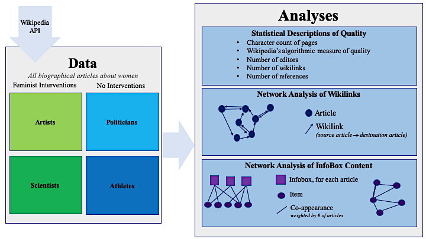

```{r setup, include=FALSE}
knitr::opts_chunk$set(echo = TRUE)

```

# Bridging the Gender Divide in Wikipedia: A computational approach to assessing the impact of two feminist interventions

## Data Collection Processes 

###Intro to Data 
This paper analyzes the effects of two feminist initiatives on the production of Wikipedia content. See figure 1 for an overview of the research design. This document reviews the data collection processes from Wikipedia. Sampling was conducted differently for the 4 professional groups studied in this paper: Artists and Scientists were identified via the pages where the movement's have made edits; Athletes and Politicians were identified through their Wikipedia category and a random sample was chosen to match the size of the other two groups. 

For each page the following data is collected: 
 
 - **Title:** Name of article 
 - **PageID:** Wikipedia object code 
 - **Length:** number of bytes (approximately one byte per character) on the page 
 - **aveViews:** Average number of daily visitors to the page 
 - **editorCount:** Number of editors who have contributed to the page 
 - **infobox:** List of Infobox items on the page 
 - **Categories:** List of categories the page belongs to
 - **WikiLinks:** List of all internal Wikipedia links on the page 
 
(Additionally aiming to collect number of references and Wikipedia's measure of quality, but that will need to be done either directly via the Wikipedia API or a different wrapper, still being determined at this moment )
 
```{r pressure, echo=FALSE, fig.cap="Figure 1: research design", out.width = '100%'}

```


### Collecting Data from the Two Movements 

First we identified pages that were either created or edited by the feminist movements by collecting the movement statistics from the editing dashboards provided and managed by Wikipedia's parent company, The Wikimedia Foundation. This data was filtered to only inlcude articles from the English Wikipedia (en.wikipedia.org) and all biographical articles were extracted. 


Dashboard for 500 Women Scientists: https://outreachdashboard.wmflabs.org/courses/Women_in_STEM_Groups/Ada_Lovelace_Day_Wikithons
```{r}

```

Dashboard for Art+Feminism: 
https://outreachdashboard.wmflabs.org/campaigns/artfeminism_2018/programs


The data from the dashboards also includes: 

 - characters added by the movement (+ for additions, - for deletions)
 - whether the page was created by the movement (True/Fasle) 


### Gathering Article Data 

The wptools Python wrapper (https://github.com/siznax/wptools) for the Wikipedia API was used to access Wikipedia data. (@ Matt, I can't get the python wrapper to work in RStudio so please see the Wikipedia.py file. please let me know if I'm doing something incorrect!) 


### Summaries of Data 

**Scientists** 

```{r}
Scientists <- read.csv("~/Desktop/describing_your_data/wikipedia_api/500WomenScientistsList.csv")
```

__Number of New Articles vs. Articles Edited (False)__
```{r}
new_articles<-summary(Scientists$new)
new_articles <- 
```


